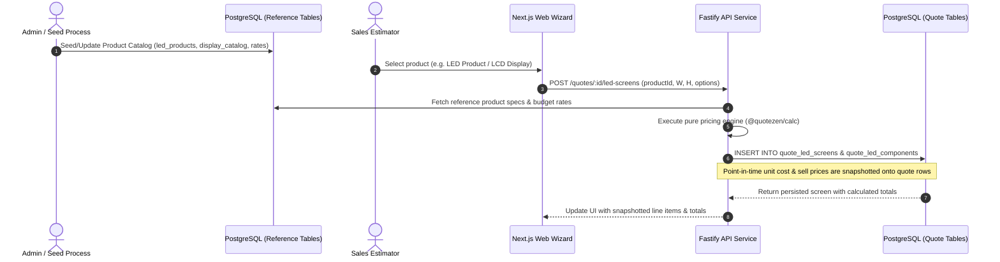
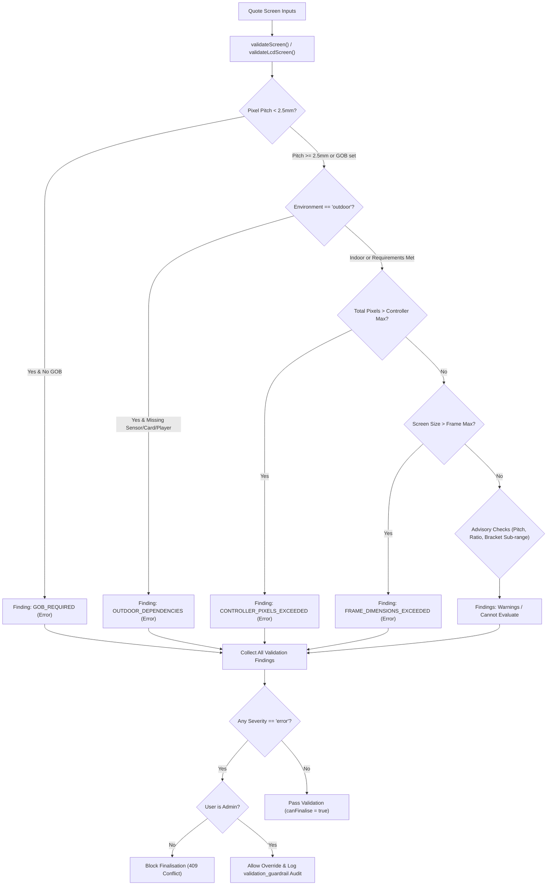
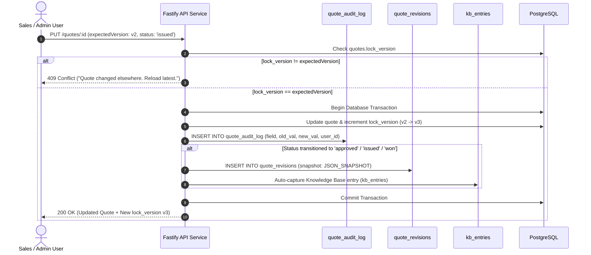

# QuoteZen — System & Calculation Flow Document

This document details the end-to-end operational, data, pricing calculation, and governance flows within the QuoteZen quoting platform.

---

## 1. End-to-End System Architectural Flow

QuoteZen operates as a monorepo containing a shared calculations package, a Fastify API layer, a Next.js 16 App Router frontend, and a PostgreSQL database.

```mermaid
graph TD
    A["Excel Workbook (2026-XXX Quote Base V1.3)"] -->|extract_catalog.py| B["prisma/data/catalog.json"]
    B -->|import-catalogs.ts & seed.ts| C[("PostgreSQL Database (58 Tables)")]
    
    subgraph Core Monorepo Packages
        D["@quotezen/shared (Types, Zod Schemas, Money Helpers)"]
        E["@quotezen/calc (Pure Pricing Engine & Formulas)"]
        F["@quotezen/db (Prisma Schema & Client)"]
    }

    C <--> F
    F --> G["apps/api (Fastify REST Service)"]
    D --> E
    E --> G
    E --> H["apps/web (Next.js 16 Quote Wizard)"]
    G <-->|REST API / JWT Auth| H

    G --> I["Proposal PDF Export (pdfkit)"]
    G --> J["Procurement BOM & Solution Summary"]
    G --> K["PM Handoff & Risk Register"]
```

---

## 2. Catalog Ingestion & Snapshot Execution Flow

Catalog items are read-only reference data. When added to a quote, item properties and unit pricing are **snapshotted** on the quote transactional tables to preserve audit history.



---

## 3. User Questionnaire & Quote Wizard State Flow

The wizard guides the user through five structured steps. State transitions allow skipping steps, live total updates, and optimistic lock checks.

```mermaid
stateDiagram-v2
    [*] --> Step1_Details: Create / Open Quote

    state Step1_Details {
        [*] --> IntakeContext
        IntakeContext --> ClientLocationCurrency: Select Client, Location, Currency
        ClientLocationCurrency --> SharedViewers: Assign Viewers & Permissions
    }

    Step1_Details --> Step2_LED: Save & Proceed

    state Step2_LED {
        [*] --> EnterDimensions
        EnterDimensions --> AutoConfigurator: Provide W x H or Resolution
        AutoConfigurator --> RankOptions: Calculate Fill %, Cabinets, Ratio
        RankOptions --> ChooseTier: Select Good/Better/Best Tier
        ChooseTier --> SelectOptions: Pick Controller, Player, Frame, GOB, Services
    }

    Step2_LED --> Step3_LCD: Proceed to LCD

    state Step3_LCD {
        [*] --> BrowseCatalog
        BrowseCatalog --> SelectDisplay: Pick Panel from Display Catalog (543 items)
        SelectDisplay --> ConfigureLcd: Set Qty, Orientation & Site Requirements
    }

    Step3_LCD --> Step4_Licences: Proceed to Licences

    state Step4_Licences {
        [*] --> SelectSoftware
        SelectSoftware --> ConfigureTiering: Enter Screen & Interactive Count
        ConfigureTiering --> SelectHardwareSupport: Pick Support Tier (Silver/Gold/Platinum)
    }

    Step4_Licences --> Step5_Review: Proceed to Review

    state Step5_Review {
        [*] --> ItemisedPriceView
        ItemisedPriceView --> ApplyOverrides: Custom Price Overrides (Audited)
        ApplyOverrides --> ValidateQuote: Run Validation & Conflict Engine
        ValidateQuote --> CheckMarginFloor: Evaluate Gross Margin vs Floor Guardrail
        CheckMarginFloor --> FinaliseQuote: Transition Status (Approved / Issued)
    }

    FinaliseQuote --> [*]: Export Proposal PDF / BOM / Summary
```



---

## 4. Pricing Engine Execution Flow (`packages/calc`)

Every quote recompute follows a strict functional sequence within `packages/calc`.

```mermaid
flowchart TD
    A["Raw Quote Inputs (Width, Height, Product ID, Options, Location, FX Rates)"] --> B["1. Geometry Calculation (geometry.ts)"]
    
    subgraph Geometry Engine
        B --> B1["Snap opening to whole cabinets: Cabs_W x Cabs_H"]
        B1 --> B2["Calculate snapped area (m²), weight (kg), power (W)"]
        B2 --> B3["Calculate resolution Wpx x Hpx & total pixels"]
        B3 --> B4["Resolve ratio GCD and map to screen_ratios label"]
    end

    B4 --> C["2. LED Supply & Add-Ons (led.ts)"]
    
    subgraph LED Supply Engine
        C --> C1["Supply Cost = Area x USD_Cost / USD_FX"]
        C1 --> C2["Supply Sell = Supply Cost x LED Markup (1.5x)"]
        C2 --> C3["Calculate Spares (10%), Packaging %, Receiver Cards"]
        C3 --> C4["Calculate GOB Coating cost & High-Res Uplift"]
    end

    C4 --> D["3. Controller Auto-Selection (controller.ts)"]
    D -->|Find min capacity >= TotalPixels| D1["Select Controller & Snap Unit Prices"]

    D1 --> E["4. Installation & Freight Calculation (install.ts, freight.ts)"]
    
    subgraph Services Engine
        E --> E1["Estimate Labour Hours = 2 + ceil(Area) + FrameHours + HangingUplift"]
        E1 --> E2["Labour Cost = Hours x (AssemblyRate $45 + LocationUplift)"]
        E2 --> E3["Freight Weight = max(ActualWeight, VolumetricWeight)"]
        E3 --> E4["Calculate Sea Freight AUD or Flat Freight Override"]
        E4 --> E5["Services Sell = (Labour + Access + Freight) x ServiceMarkup (1.65x) + Engineering"]
    end

    E5 --> F["5. LCD & Licence Tiering (lcd-tiers.ts, licence.ts)"]
    F --> F1["Annual Licence = $270 Site + ScreenCount x $125 + Interactive x $100"]

    F1 --> G["6. Quote Aggregation & Rollup (quote.ts)"]
    
    subgraph Rollup & Overrides
        G --> G1["Sum Up-front Equipment + Services + Annual Recurring"]
        G1 --> G2["Apply Reseller Markup (if configured)"]
        G2 --> G3["Apply Pinned Item Overrides (quote_overrides)"]
        G3 --> G4["Calculate Overall Quote Gross Margin %"]
    end

    G4 --> H["Final Calculated Quote Object"]
```



---

## 5. Conflict & Validation Pipeline Flow

The validation engine checks technical dependencies and business rules before allowing status finalisation.



---

## 6. Governance, Snapshot & Versioning Flow

Mutations on a quote follow strict transactional logging, optimistic locking, and revision snapshotting.


