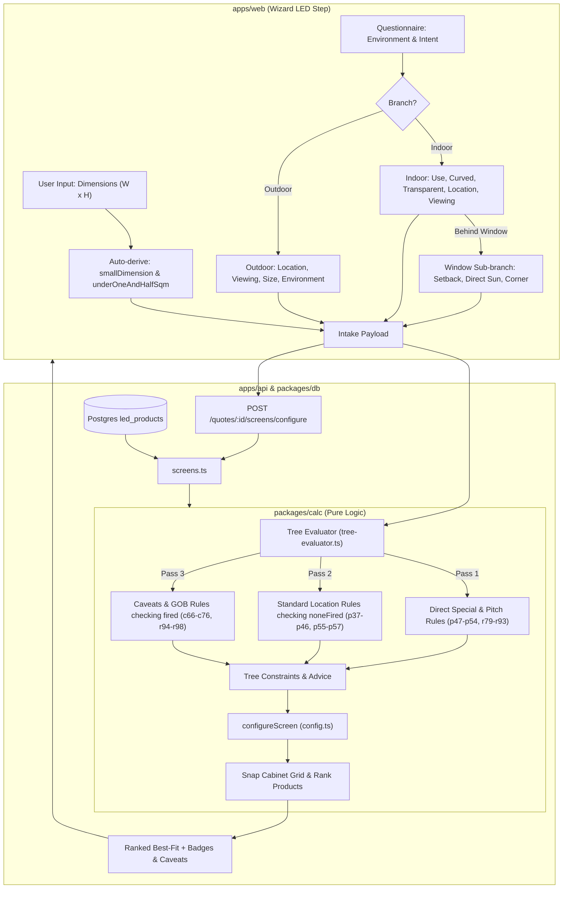

# LED Selection Tree Integration Plan

This plan details the additive extension of QuoteZen's existing screen configuration and selection engine to support the **LED Selection Tree** (`tree.json` / `2026 V1.0 LED Selection Tree.xlsx`).

---

## 1. Overview & Architectural Goals

* **Additive & Non-Breaking:** The existing geometric cabinet snapping (`snapAxis`), area fill calculations, aspect ratio heuristics, and Good/Better/Best tiering (`selectTiers`) remain intact. The Selection Tree acts as a **smart pre-filter and recommendation guidance layer**.
* **Zero-IO / Pure Engine:** The rule evaluation engine lives in `packages/calc`, keeping pricing and technical evaluation testable and browser-compatible without database dependencies.
* **Progressive Disclosure in UI:** The 24 questions from `tree.json` are organized into dynamic branches (Indoor vs. Outdoor, Window sub-branch), with dimensions and area auto-derived from W × H where possible.
* **Defect Correction:** The evaluator applies corrected rule logic (`whenFixed` in `tree.json`) by default to prevent workbook bugs (typos, contradictory conditions, wrong cell references) from causing silent fallthroughs.

---

## 2. Architecture & Data Flow

---

## 3. Step-by-Step Implementation Blueprint

### Phase 1: Pure Decision Tree Evaluator (`packages/calc`)

1. **Create `packages/calc/src/tree-evaluator.ts`**:
   * Define input interface `LedIntakeAnswers` covering all 24 questions from `tree.json`.
   * Define output interface `TreeConstraints`:
     * `recommendedModelFamilies: string[]` (e.g. `['FLEX']`, `['BM', 'WallPad']`, `['TGC', 'Muxwave']`, `['FS-PRO']`)
     * `pitchMinMm?: number`, `pitchMaxMm?: number`, `pitchLabel?: string`
     * `gobRequired: boolean`
     * `minBrightnessNits?: number`
     * `minRefreshRateHz?: number`
     * `caveats: string[]` (dynamic contextual notes `c66`–`c76`)
     * `primaryRecommendationText: string`
   * Implement `evaluateSelectionTree(answers: LedIntakeAnswers, options?: { fixDefects?: boolean })`:
     * **Pass 1**: Evaluate special product overrides (`p47`–`p54`) and direct pitch rules (`r79`–`r93`, `r99`–`r103`).
     * **Pass 2**: Evaluate fallback / standard location rules (`p37`–`p46`, `p55`–`p57`, `p62`).
     * **Pass 3**: Evaluate caveat rules (`c66`–`c76`) and GOB requirement (`r94`).
     * Map active rule IDs into `TreeConstraints`.

2. **Unit Testing (`packages/calc/src/tree-evaluator.test.ts`)**:
   * Test special overrides: Curved -> FLEX; Transparent -> TGC/Muxwave; Ceiling; Double-sided.
   * Test standard indoor wall/window cases with Value vs. Quality.
   * Test outdoor severe conditions (salt air, high availability, snow/ice).
   * Test pitch and GOB activation across viewing distances.

---

### Phase 2: Extend Screen Configurator (`packages/calc/src/config.ts`)

1. **Update `ConfigRequest` & `ConfigProduct`**:
   * Add `treeConstraints?: TreeConstraints` to `ConfigRequest`.
   * Add `isTransparent?: boolean` and `curveCapability?: string | null` to `ConfigProduct`.
2. **Update `configureScreen` Filtering & Ranking**:
   * **Model Family Boosting / Filtering**: If `treeConstraints.recommendedModelFamilies` is provided, prioritize or filter matching products by model code or category.
   * **Pitch Range Constraints**: Exclude products coarser than `pitchMaxMm` or finer than `pitchMinMm` (when specified).
   * **Brightness / Capability Filtering**: Enforce `minBrightnessNits` and `isTransparent` when required.
   * **Output Enrichment**: Carry `caveats`, `pitchLabel`, and `primaryRecommendationText` into `ConfigResult`.

---

### Phase 3: Shared Schemas & Database Layer (`packages/shared` & `packages/db`)

1. **In `packages/shared/src/schemas.ts`**:
   * Create `ledIntakeSchema` Zod validation schema.
   * Add `intake: ledIntakeSchema.optional()` to `configureSchema`.
   * Add `intakeAnswers: z.record(z.unknown()).optional()` to `ledScreenSchema` to persist decisions.
2. **In `packages/db/prisma/schema.prisma`**:
   * Add `intakeAnswers Json? @map("intake_answers")` on `QuoteLedScreen` (preserves historical intake responses in quote snapshots and PM handoffs).
   * Author migration via `prisma migrate diff` and apply.

---

### Phase 4: API Layer (`apps/api`)

1. **In `apps/api/src/modules/quotes/routes.ts`**:
   * Accept `intake` in `POST /quotes/:id/screens/configure` and `POST /quotes/:id/screens/options`.
   * (Optional) Add standalone `POST /quotes/:id/screens/evaluate-tree` for live UI advice without re-running full cabinet geometry.
2. **In `apps/api/src/modules/quotes/screens.ts`**:
   * In `configureForQuote` and `optionsForQuote`, run `evaluateSelectionTree(input.intake)` and pass the resulting `treeConstraints` into `configureScreen(...)`.
   * In `addLedScreen`, persist `intakeAnswers` to the database record.

---

### Phase 5: Web Wizard UI (`apps/web`)

1. **In `apps/web/app/quotes/[id]/page.tsx` (`LedAddForm`)**:
   * Create an interactive **"Guided Screen Advisor"** section with progressive disclosure:
     * **Level 1 (Core Intent):** `Environment` (Indoor / Outdoor), `Priority` (Value / Quality).
     * **Level 2 (Indoor Context):** `Use`, `Viewing Distance`, `Location`, `Physical Damage Risk`, Special checkboxes (`Curved / Flex`, `Transparent`, `Exact 16:9`).
     * **Level 2a (Window Sub-branch):** If `Location === 'Behind Window'`, conditionally show `Can set back >500mm`, `Direct sunlight`, `High ambient light`, `Convex corner`.
     * **Level 2 (Outdoor Context):** `Location`, `Viewing Distance`, `Hard to service`, `High availability`, `Photogenic`, `Salt air / Snow`.
   * **Auto-Derived Calculations**:
     * Auto-compute `underOneAndHalfSqm` and `smallDimension` from `w` and `h` inputs.
     * Auto-derive `serviceAccess` from `outdoorLocation`.
   * **Live Advisor Summary Banner**:
     * Displays real-time recommendation: Recommended Family (e.g. *LEDFul BM-PRO / WallPad*), Target Pitch (*P1.2–P1.5*), and GOB indicator.
     * Renders active caveats (`c66`–`c76`) as callout warnings.
   * **Option Badges in Ranked Results**:
     * Tag candidate cards with `⭐ Recommended Family` and `🛡️ GOB Required`.

---

## 4. Verification & Testing Strategy

1. **Calc Unit Tests (`pnpm --filter @quotezen/calc test`)**:
   * Verify all 62 rules in `tree.json` against expected outputs in `tree-evaluator.test.ts`.
   * Verify cabinet grid snapping with tree constraints in `config.test.ts`.
2. **API Integration Tests (`pnpm --filter @quotezen/api test`)**:
   * Test `/quotes/:id/screens/configure` with complete and partial intake payloads.
3. **Full Monorepo Typecheck & Lint (`pnpm typecheck && pnpm lint`)**:
   * Ensure strict TypeScript types across all 5 packages/apps.
4. **End-to-End Browser Walkthrough (`pnpm --filter @quotezen/web dev`)**:
   * Verify progressive disclosure animations, auto-derived dimension flags, and ranked table tagging in the wizard.
